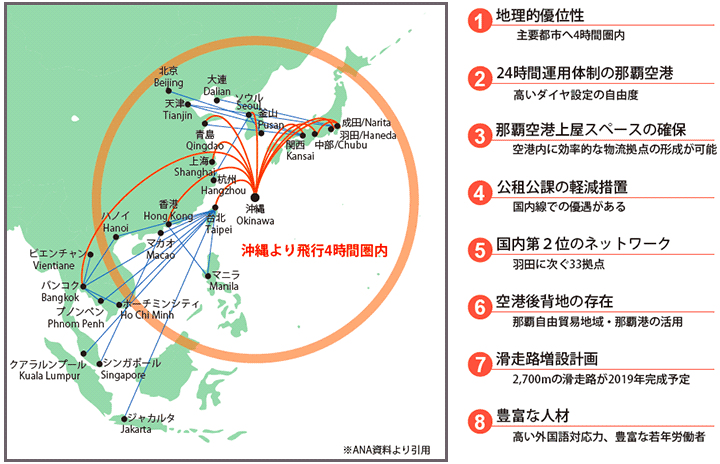
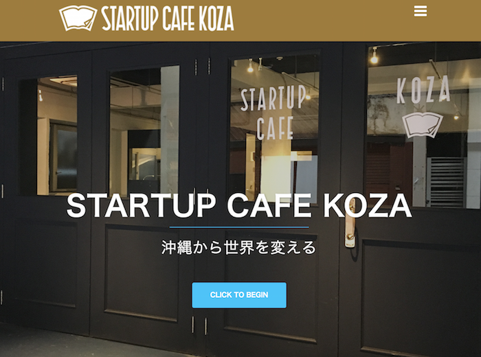
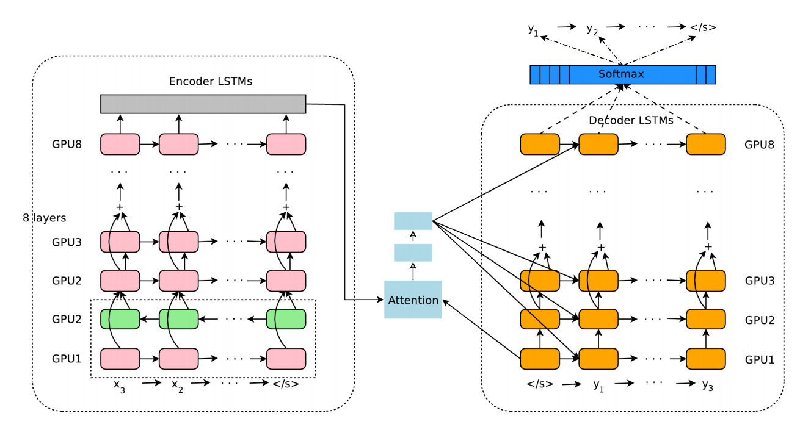
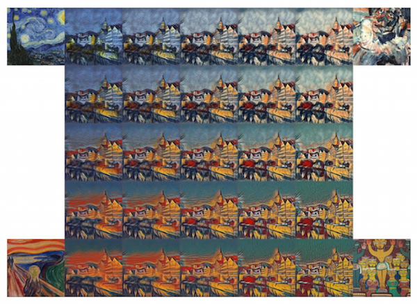
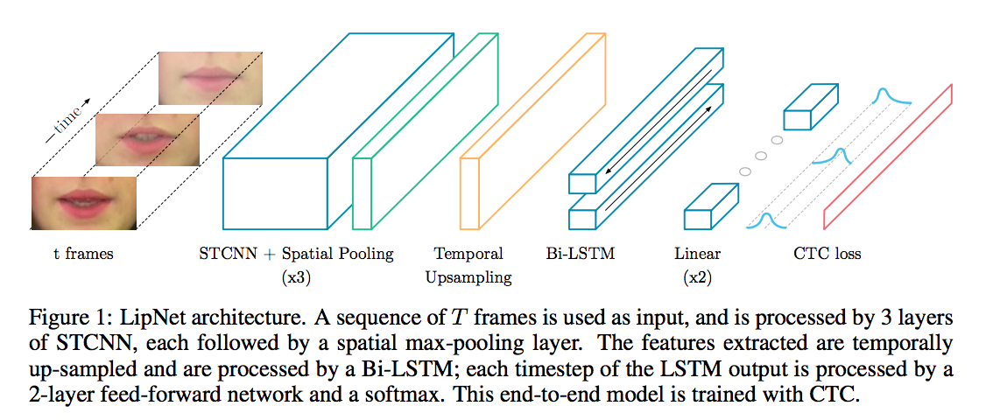
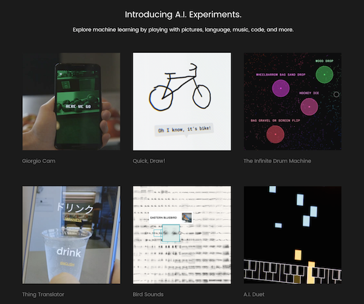
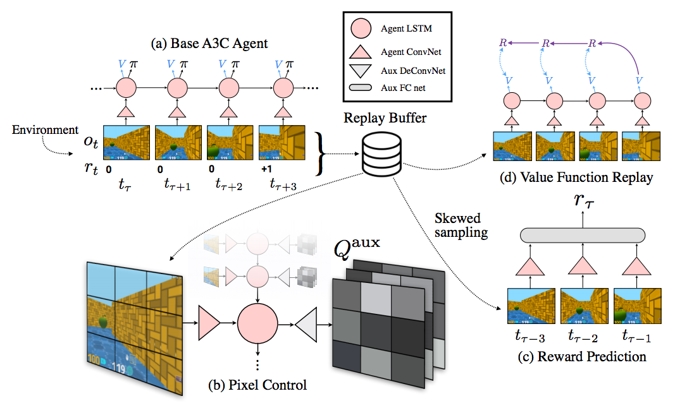
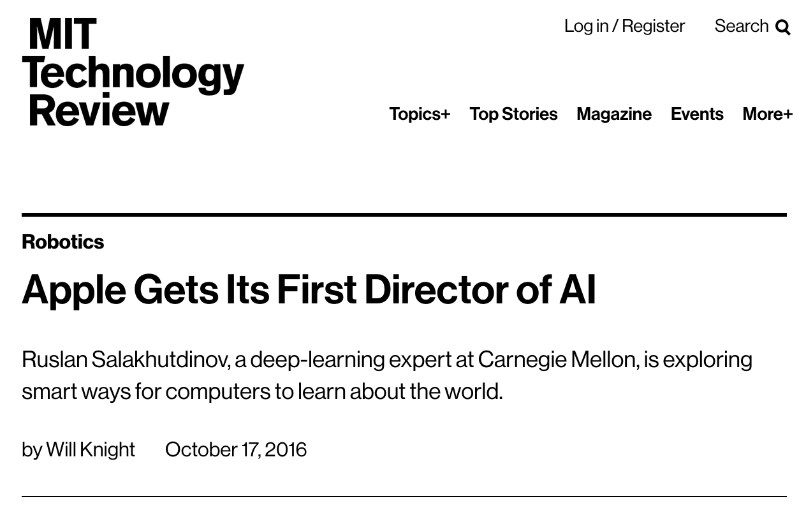
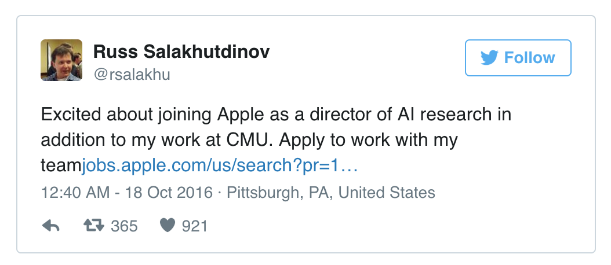

<!-- page_number: false -->

# Welcome to PyData.Okinawa

## Meetup 19 - Interactive Visualization

### 2016/11/19 (SAT) 9:00-12:00 @ [Startup Cafe Koza](startup-cafe.okinawa)

- Twitter: @PyDataOkinawa (#PyDataOkinawa)
- Meetup: https://www.meetup.com/PyData-Okinawa/
- Connpass: http://pydataokinawa.connpass.com/
- HP: http://pydata.okinawa
- Slack: https://pydataokinawa.slack.com

---
# Schedule

| Time |  |	Speaker |
|:------|:------|:-------------|
| 8:55	| Opening | |
| 9:00-9:20 | Introduction to PyData.Okinawa | Organizer |
| 9:20-9:30 | Self-introduction | Everybody |
| 9:30-10:15 | Interactive visualization with ipywidgets | Everybody |
| 10:15-10:30 | Break |  |
| 10:30-11:30 | Interactive visualization with Plotly | Everybody |
| 11:30-11:50 | Lightening Talks | Volunteers |
| 11:50-12:00 | Closing | Everybody |

---

# What is PyData.Okinawa?

Creative Commons BY 2.0:
https://www.happytellus.com/gallery.php?img_id=2668

---

# What is PyData.Okinawa?

Creative Commons BY 2.0
http://free-photo.net/archive/entry5175.html

---

# What is PyData.Okinawa?

- PyData.Okinawa is a community for people who are interested in python, data analytics, and/or machine learning.
- We use python 2.7 as a main language, but you can of course pick your favorite langauge that suits your needs.
- We use English as a "recommended language" after 18th meetup, so native English speaker living here or visiting Okinawa from other countries can join our meetup.

---

# Data Science Community

#### PyData 
- [PyData in the World](https://www.meetup.com/pro/PyData/)

#### PythonBeginners 沖縄（Japanese）

- Mokumoku-kai for Python beginners in Okinawa

- http://python-beginners-okinawa.connpass.com/
- Ask Suzuki-san for more information

#### PythonBeginners沖縄・助け合い所（Japanese）
- [Facebook page](https://www.facebook.com/groups/789800504490702/)

---

# Why PyData.Okinawa?

- Data science is developing in exponential rate.
- Difficult to follow the current trend by yourself even if you use the web.
- This is especially true if you live in Okinawa and try to catch up with this trend by yourself only using Japanese language.
- People can fill in these gaps.
- PyData.Okinawa is experimental.
- We continue as long as it is fun.

---

# PyData.Okinawa News

---

# English as a recommended langauge

- Easier for English speaker to join our community
- English is an important tool in this fast growing world

---

# New organizers

| | |
|:-----:|:------:|
|M. Otsuka |  |
|Y. Tachibana (Sabo) |  |
|K. Tamashiro (Aipa) |  | 
|T. Nakanishi |  |

---

# New Venue

[Startup Cafe Koza](http://startup-cafe.okinawa/)

---

# Google's Neural Machine Translation

2016/09/27 - [A Neural Network for Machine Translation, at Production Scale](https://research.googleblog.com/2016/09/a-neural-network-for-machine.html)

2016/11/12 - [待ってた！ついにGoogle翻訳がニューラルネット機械翻訳を日本語版にも適用。異常に上がった翻訳性能は感動モノ](https://bita.jp/dml/gtransrate_upgrade)

2016/11/16 - [Google 翻訳が進化しました。(Google Japan Blog) ](https://japan.googleblog.com/2016/11/google.html)

---

# Supercharging Style Transfer

2016/10/26

https://research.googleblog.com/2016/10/supercharging-style-transfer.html

---

# LipNet

2016/11/09

http://www.cs.ox.ac.uk/news/1217-full.html

---

# Google's AI Experiments

- 2016/11/15 - [AI Experiments](https://aiexperiments.withgoogle.com/)
- 2016/11/15 - [Google’s AI Experiments help you understand neural networks by playing with them (TechCrunch)](https://techcrunch.com/2016/11/15/googles-ai-experiments-help-you-understand-neural-networks-by-playing-with-them/)

---

# Reinforcement learning with unsupervised auxiliary tasks

[DeepMind's official blog post](https://deepmind.com/blog/reinforcement-learning-unsupervised-auxiliary-tasks/) (2016/11/17)

---

---

---

# KOZA Machine Learning Bootcamp

2016/12/10 (SAT) 9:00-18:00
2016/12/11 (SUN) 9:00-18:00

http://kozaml.com/wp01/

---

# Deep Learing Hands-on @ OIST

2016/11/30 (WED)

- Let me know if you are interested in this hands-on session.
- This is NOT a deep learning tutorial.
- Basic knowledge of deep learning is assumed. 

---

# PyData.Okinawa

## Date and Time

* Every 3rd Saturday 9:00-12:00

## Fee

- 1500 yen
- Organizers also pay

## Other

- Happy coding ;)

---

# Self-introduction

- about 1 min per person

---

# Interactive Visualization

---

## PyData.Okinawaのこれまで (1/4)
- [PyData.Okinawa Meetup #1 - PyData事始め](http://pydataokinawa.connpass.com/event/15567/)
- [PyData.Okinawa Meetup #2 - データ可視化](http://pydataokinawa.connpass.com/event/16388/)
- [PyData.Okinawa Meetup #3 - scikit-learn入門](http://pydataokinawa.connpass.com/event/17652/)
- [PyData.Okinawa Meetup #4 - モデル選択](http://pydataokinawa.connpass.com/event/18396/)
- [PyData.Okinawa Meetup #5 - 復習ミニハッカソン](http://pydataokinawa.connpass.com/event/20225/)

---

## PyData.Okinawaのこれまで (2/4)

- [PyData.Okinawa Meetup #6 - 「データサイエンティスト養成読本：機械学習入門編」読書会 1](http://pydataokinawa.connpass.com/event/20441/) 
  - 第１部　特集１ 機械学習を使いたい人のための入門講座 （よぎさん）
  - 第１部　特集２　機械学習の基礎知識 （ひがさん）
- [PyData.Okinawa Meetup #7 - 「データサイエンティスト養成読本：機械学習入門編」読書会 2](http://pydataokinawa.connpass.com/event/21648/)
    - 第１部　特集２　機械学習の基礎知識 （古川さん）
    - 第２部　特集２ Pythonによる機械学習入門 （岩村さん） 

- [PyData.Okinawa Meetup #8 - 「データサイエンティスト養成読本：機械学習入門編」読書会 3](http://pydataokinawa.connpass.com/event/23825/)　
    - 第２部　特集２ Pythonによる機械学習入門 （岩村さん）
    - 第１部　特集３ビジネスに導入する機械学習 （玉城さん）

---

## PyData.Okinawaのこれまで (3/4)

- [PyData.Okinawa Meetup #9 - 「データサイエンティスト養成読本：機械学習入門編」読書会 4](http://pydataokinawa.connpass.com/event/24769/)
    - 第１部　特集４ 深層学習最前線 （大塚さん）
- [PyData.Okinawa Meetup #10 - 「データサイエンティスト養成読本：機械学習入門編」読書会 5](http://pydataokinawa.connpass.com/event/27214/)　
    - 第２部　特集４ Pythonで画像認識にチャレンジ （ちんさん）
- [PyData.Okinawa Meetup #11 - 「データサイエンティスト養成読本：機械学習入門編」読書会 6](http://pydataokinawa.connpass.com/event/27705/)　
    - 第２部　特集３ 推薦システム入門 （玉城さん）
- [PyData.Okinawa Meetup #12 - 寄り合い](http://pydataokinawa.connpass.com/event/30259/)

 

---

## PyData.Okinawaのこれまで (4/4)

- [PyData.Okinawa Meetup #13 - kaggle](http://pydataokinawa.connpass.com/event/31066/) - Kobe Bryant Shot Selection
- [PyData.Okinawa Meetup #14 - kaggle](http://pydataokinawa.connpass.com/event/32554/) - Shelter Animal Outcomes (Part 1)
- [PyData.Okinawa Meetup #15 - kaggle](http://pydataokinawa.connpass.com/event/34305/) - Shelter Animal Outcomes (Part 2)
- [PyData.Okinawa Meetup #16 - kerasで深層学習](http://pydataokinawa.connpass.com/event/36115/) 
- [PyData.Okinawa Meetup #17- Magentaで音楽生成](http://pydataokinawa.connpass.com/event/39806/)
- [PyData.Okinawa Meetup #18 - Pandasでデータ前処理](http://pydataokinawa.connpass.com/event/41618/)